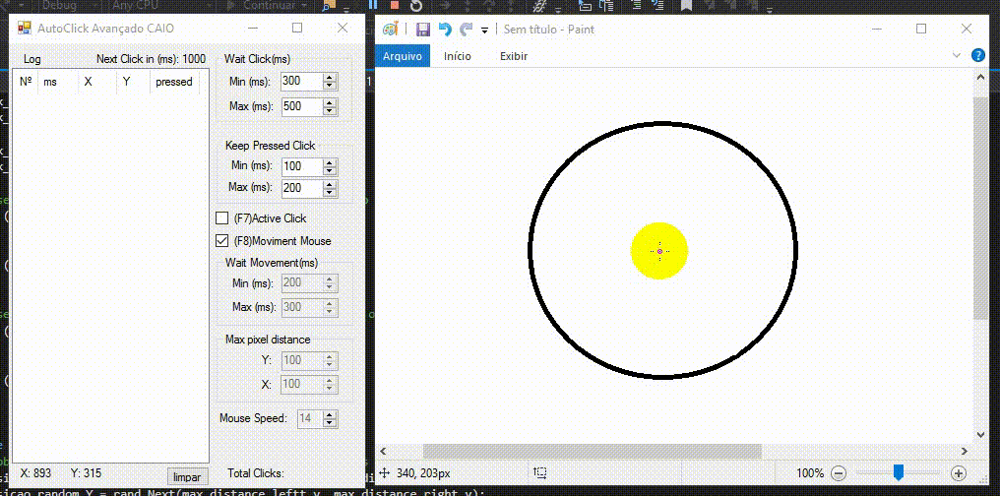
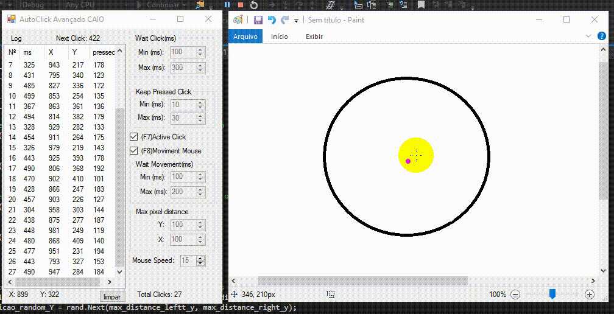

Auto Clique Avançado demo.

######O que é um auto click?
Um  auto click é um tipo de software ou macro que pode ser usado para automatizar o clique.

######Como geralmente é detectado um auto click ?
Geralmente os sistemas de seguranças que detectam um auto click, captam os segundos, tempo de pressionamento, e cordenadas após cada clique. com base nesses fatores é realizado calculos onde é possivel saber se é uma pessoa ou um script.

######Porque é indetectável?
Porque este auto clique ele gera números aleatórios definidos pelo pelo usuário de milésimos segundos para cada  click, tempo de pressionamento e movimento do mouse. 

--------------------------------
### Example 1

### Example 2
